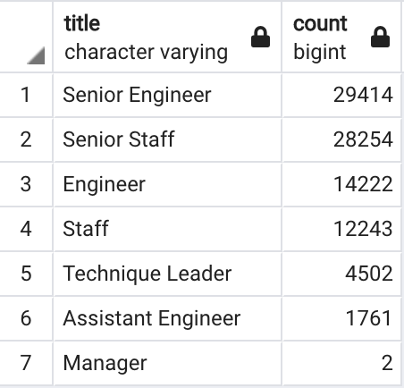
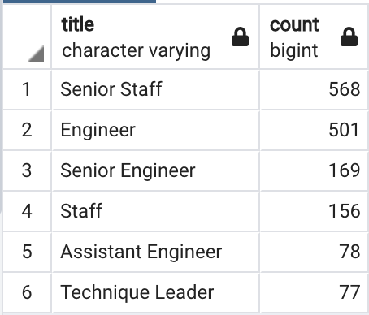

# Pewlett-Hackard-Analysis

## Overview
The purpose of our project is to determine the number of retiring employees by title and identify which employees are eligible to to participate in the mentorship program. 
First we created a query that retrieved the emp_no, first_name and last_name columns from the employees table and retrieved the title,from_date and to_date columns of the titles table in our pewlett-hackard query. We joined both of these table on the primary key,filtered the data by birth_date and put the information into a new table.

## Results
The first table that determines the number of retiring employees and their position titles can be viewed here: [retiring_titles.csv](https://github.com/crdhilep/Pewlett-Hackard-Analysis/blob/main/Data/retiring_titles.csv)

A mentorship-eligibility table that holds the current employees who were born between January 1, 1965 and December 31, 1965 was created and can be viewed here: [mentorship_eligibility.csv](https://github.com/crdhilep/Pewlett-Hackard-Analysis/blob/main/Data/mentorship_eligibilty.csv)

## Summary

- 90398 employees were retiring from the company

- 1549 current employees were eligible for the mentorship program.

